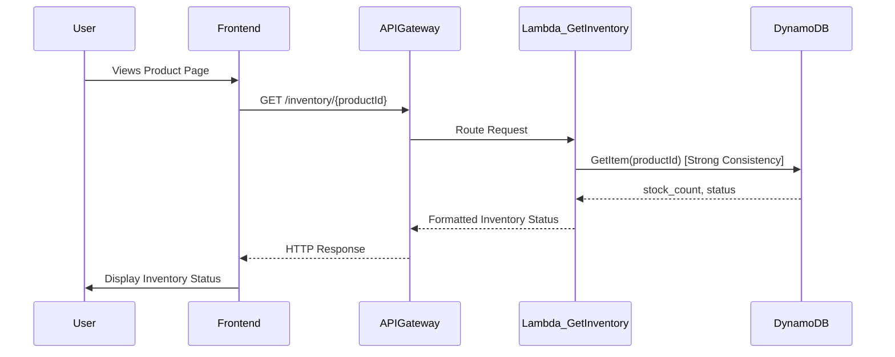

# System Flow Document: Real-Time Inventory Check Component

**Version:** 1.0
**Date:** May 6, 2025

## 1. System Overview

This document outlines the technical flows and interactions of the Real-Time Inventory Check Component designed for E-commerce platforms. The primary goal is to address the "phantom inventory" problem by providing accurate and up-to-date stock levels to customers and managing inventory state throughout the purchase lifecycle.

The system leverages a serverless architecture on AWS, consisting of:

*   **AWS Lambda:** Hosts the core business logic for checking, updating, reserving, and releasing inventory. Also runs a scheduled function for low-stock notifications.
*   **Amazon API Gateway:** Provides RESTful API endpoints for the frontend and administrative clients to interact with the Lambda functions securely.
*   **Amazon DynamoDB:** Acts as the persistent, highly available database for storing product inventory data, including stock levels, reservations, thresholds, and status. Utilizes strong consistency for critical operations.
*   **Amazon S3:** Hosts the static frontend assets (HTML, CSS, JavaScript) for the customer-facing components and admin panel.
*   **Amazon SNS:** Publishes notifications when product inventory levels fall below a configured threshold.
*   **Amazon CloudWatch:** Collects logs, metrics, and triggers scheduled events for the Lambda functions.

The system ensures data consistency through conditional updates in DynamoDB and manages temporary stock allocations using DynamoDB's TTL feature.

## 2. User Workflows

This section details the primary user journeys through the inventory system.

### 2.1. Viewing Product Inventory

A customer browses the website and lands on a product details page, requiring the current stock status to be displayed.

1.  Customer navigates to a product page on the e-commerce website.
2.  The frontend (served from S3) loads and executes JavaScript.
3.  The frontend makes an asynchronous GET request to `/inventory/{productId}` endpoint via API Gateway.
4.  API Gateway receives the request and routes it to the `getInventoryLevel` Lambda function.
5.  The `getInventoryLevel` Lambda queries the `inventory-management` DynamoDB table using `product_id` and `warehouse_id` (if applicable, derived from context like user location or default warehouse). The query is performed with *strong consistency*.
6.  DynamoDB returns the current `stock_count`, `status`, and potentially `reserved_count` to the Lambda function.
7.  The Lambda function processes the data and formats a response (e.g., "In Stock", "Low Stock - Only 5 left!", "Out of Stock").
8.  API Gateway receives the response from Lambda and returns it to the frontend.
9.  The frontend updates the product page to display the real-time inventory status to the customer.



### 2.2. Adding Product to Cart (Inventory Reservation)

When a customer decides to purchase, the system temporarily reserves the items to prevent over-selling.

1.  Customer clicks "Add to Cart" on a product page.
2.  The frontend sends a POST request to `/inventory/{productId}/reserve` via API Gateway, including the quantity to reserve.
3.  API Gateway routes the request to the `reserveInventory` Lambda function.
4.  The `reserveInventory` Lambda reads the current `stock_count` and `reserved_count` from DynamoDB.
5.  The Lambda checks if `stock_count - reserved_count` is greater than or equal to the requested quantity.
6.  If sufficient stock is available, the Lambda performs a conditional update on the DynamoDB item to increment `reserved_count` by the requested quantity. This update uses a conditional expression (e.g., `stock_count - reserved_count >= :quantity`) to ensure atomicity and prevent concurrent reservations from over-selling.
7.  The update also sets or updates a `reservation_expiry` attribute with a TTL, ensuring the reservation is automatically released if checkout is not completed within a set time.
8.  DynamoDB confirms the update or rejects it if the condition fails.
9.  The Lambda function returns a success response (including a reservation ID) or an error response (e.g., "Insufficient Stock").
10. API Gateway returns the response to the frontend.
11. The frontend updates the cart status or displays an error message.

### 2.3. Completing Checkout (Inventory Decrement)

Upon successful checkout, the reserved inventory is permanently decremented from the total stock.

1.  Customer confirms the order during the checkout process.
2.  The frontend sends a PUT request to `/inventory/{productId}` via API Gateway (or a dedicated checkout endpoint that triggers this logic), including the quantity reserved (using the reservation ID).
3.  API Gateway routes the request to the `updateInventoryLevel` or a dedicated `decrementInventory` Lambda function (using `updateInventoryLevel` with specific parameters in this design).
4.  The Lambda performs a conditional update on the DynamoDB item: decrement `stock_count` by the reserved quantity and decrement `reserved_count` by the same quantity.
5.  This update *must* use a conditional expression to ensure the decrement happens only if the reservation still exists and matches the expected quantity, preventing double-counting or decrementing stock that was already released by TTL. The TTL for this reservation should also be cleared or the item updated to remove the reservation state.
6.  DynamoDB confirms the update or rejects it (e.g., if the reservation was released).
7.  The Lambda function returns a success or failure response.
8.  API Gateway returns the response to the backend order processing system or frontend.

### 2.4. Admin Updating Inventory

An administrator adjusts stock levels, typically after receiving new shipments or correcting errors.

1.  Admin user accesses the admin panel (served from S3).
2.  Admin user authenticates (details not fully specified, assume secured).
3.  Admin user updates the stock quantity for a product in the admin UI.
4.  The frontend sends a PUT request to `/inventory/{productId}` via API Gateway with the new stock level and potentially other attributes (`threshold_level`, `status`).
5.  API Gateway routes the request to the `updateInventoryLevel` Lambda function.
6.  The `updateInventoryLevel` Lambda performs an update on the DynamoDB item. This update should ideally be conditional (e.g., based on a version number or `last_updated` timestamp) to prevent overwriting concurrent changes, or carefully designed to handle partial updates.
7.  The Lambda also calculates the new `status` (`IN_STOCK`, `LOW_STOCK`, `OUT_OF_STOCK`) based on the new `stock_count` and `threshold_level`.
8.  DynamoDB confirms the update.
9.  The Lambda function returns a success or failure response.
10. API Gateway returns the response to the admin panel.

## 3. Data Flows

This section describes how data moves between the system components during key operations.

### 3.1. Inventory Read Flow

Data related to current inventory levels flows from the database to the user interface.

1.  **Request Initiation:** Frontend sends GET request (`/inventory/{productId}`) to API Gateway with `product_id` (and potentially `warehouse_id`).
2.  **Routing:** API Gateway extracts path parameters (`productId`) and passes them to `getInventoryLevel` Lambda.
3.  **Database Query:** `getInventoryLevel` Lambda uses `product_id` (and `warehouse_id`) to perform a `GetItem` operation on the `inventory-management` DynamoDB table. Specifies `ConsistentRead: true`.
4.  **Data Retrieval:** DynamoDB retrieves the item with the matching composite key and returns attributes like `stock_count`, `reserved_count`, `threshold_level`, `status`, `last_updated`.
5.  **Data Processing:** Lambda receives the data, potentially formats the status message based on `stock_count` and `threshold_level`.
6.  **Response Transmission:** Lambda returns a JSON response containing the relevant inventory data (e.g., `{ "stock": 10, "status": "IN_STOCK" }`) to API Gateway.
7.  **API Response:** API Gateway serializes the JSON response and returns it as the HTTP response body to the Frontend.
8.  **UI Update:** Frontend JavaScript parses the JSON and updates the displayed stock information.

```mermaid
graph LR
    A[Frontend (Request)] -->|GET /inventory/{productId}| B(API Gateway)
    B -->|Route| C(Lambda getInventoryLevel)
    C -->|GetItem(productId, ConsistentRead=true)| D[DynamoDB inventory-management]
    D -->|stock_count, status, etc.| C
    C -->|JSON Response| B
    B -->|HTTP Response| A[Frontend (Display)]
```

### 3.2. Inventory Update Flow

Data representing changes to stock levels flows from an administrative source or the checkout process to the database.

1.  **Update Initiation:** Admin panel (or Checkout process) sends PUT request (`/inventory/{productId}`) to API Gateway with `product_id` and update payload (e.g., `{"stock_count": 50}`).
2.  **Routing:** API Gateway routes the request body and path parameters to `updateInventoryLevel` Lambda.
3.  **Database Update:** `updateInventoryLevel` Lambda parses the payload and performs an `UpdateItem` operation on the `inventory-management` DynamoDB table for the specified `product_id` and `warehouse_id`. The update includes:
    *   Setting new attribute values (`stock_count`, `threshold_level`, `status`).
    *   Updating the `last_updated` timestamp.
    *   *Crucially*, using a conditional expression for operations like decrementing stock during checkout (`SET stock_count = stock_count - :decrementValue`, `SET reserved_count = reserved_count - :decrementValue` IF reservation matches). For admin updates, a different strategy might be used, potentially simple set or optimistic locking based on `last_updated`.
4.  **Data Persistence:** DynamoDB applies the update if conditions are met, ensuring data integrity.
5.  **Response:** DynamoDB returns confirmation of the update or an error (e.g., condition failed) to the Lambda.
6.  **Lambda Response:** Lambda returns a success or failure status.
7.  **API Response:** API Gateway returns the HTTP response to the Admin panel/Checkout process.

### 3.3. Low Stock Notification Flow

Data indicating low stock levels flows from the database, through a scheduled process, to the notification service.

1.  **Scheduled Trigger:** A CloudWatch Event Rule triggers the `checkThresholds` Lambda function on a schedule (e.g., every 15 minutes).
2.  **Database Scan/Query:** `checkThresholds` Lambda performs a scan or query on the `inventory-management` DynamoDB table to find items where `stock_count <= threshold_level` AND `status != "LOW_STOCK"`. (A Scan might be acceptable for a small database or infrequently; a more scalable approach might involve DynamoDB Streams and a separate process, but the prompt specified a scheduled check).
3.  **Identify Low Stock:** Lambda processes the results, identifying products that meet the low stock criteria and haven't already been flagged.
4.  **Update Status:** For identified items, the Lambda updates their `status` attribute in DynamoDB to "LOW_STOCK".
5.  **Publish Notification:** For each newly identified low-stock item, the Lambda publishes a message to the `inventory-alerts` SNS topic. The message payload includes relevant details (`product_id`, `warehouse_id`, `stock_count`, `threshold_level`).
6.  **Notification Delivery:** SNS delivers the message to subscribed endpoints (e.g., email addresses configured for admin alerts).

## 4. Error Handling

Robust error handling is critical for maintaining accurate inventory and a positive user experience.

*   **Insufficient Stock (Reservation/Checkout):**
    *   **Mechanism:** Conditional updates in DynamoDB (`reserveInventory`, `updateInventoryLevel` for decrement). The update operation will fail if the condition (e.g., `stock_count - reserved_count >= requested_quantity`) is not met at the time of execution.
    *   **Handling:** The Lambda function catches the conditional check failure, logs it, and returns an appropriate error response to the API Gateway (e.g., HTTP 409 Conflict or 400 Bad Request with a descriptive message like "Insufficient stock available"). The frontend/checkout process displays this error to the user.
*   **Concurrent Updates (Admin/Checkout):**
    *   **Mechanism:** Conditional updates or optimistic locking. While the core scenario focuses on reservation/decrement conditions, general updates (`updateInventoryLevel`) could use a version attribute or conditional check on `last_updated` to prevent one admin user's change from overwriting another's unseen modification.
    *   **Handling:** If a conditional update fails due to a concurrent modification, the Lambda logs the conflict and returns an error. The admin panel might need to refresh and allow the user to re-apply changes based on the new state.
*   **Abandoned Reservations:**
    *   **Mechanism:** DynamoDB TTL on the `reservation_expiry` attribute.
    *   **Handling:** DynamoDB automatically deletes items (or specific attributes related to the reservation) when the `reservation_expiry` timestamp is reached. This implicitly releases the reserved stock (as `reserved_count` is decremented or the item representing the reservation is removed). No explicit Lambda trigger is needed for the *deletion*, but logic *using* `reserved_count` must account for its potential change due to TTL.
*   **API/Lambda Failures:**
    *   **Mechanism:** CloudWatch Logs, CloudWatch Metrics, CloudWatch Alarms, API Gateway logging.
    *   **Handling:**
        *   Lambda functions log errors to CloudWatch Logs for debugging.
        *   CloudWatch metrics (e.g., Lambda error count, API Gateway 5xx count) provide visibility into failure rates.
        *   CloudWatch Alarms trigger notifications (e.g., via SNS) if error rates exceed thresholds, alerting operators to investigate.
        *   API Gateway access logs provide details about requests and responses, aiding troubleshooting.
*   **DynamoDB Errors:**
    *   **Mechanism:** AWS SDK exception handling within Lambda functions.
    *   **Handling:** Lambda code must catch potential DynamoDB exceptions (e.g., `ProvisionedThroughputExceededException` if using provisioned mode without autoscaling, though using PAY_PER_REQUEST minimizes this; `InternalServerError`). Implement retry logic for transient errors and surface persistent errors appropriately through the API Gateway response.

## 5. Security Flows

Securing the inventory system involves controlling access to APIs and backend resources.

1.  **API Access Control:**
    *   **Mechanism:** Amazon API Gateway API Keys and Usage Plans.
    *   **Flow:**
        *   Frontend (S3 static site) includes an API Key when making requests to API Gateway.
        *   API Gateway validates the API Key against configured Usage Plans.
        *   Requests with valid keys are allowed based on usage plan limits (throttling, quota).
        *   Requests without valid keys or exceeding limits are rejected by API Gateway before reaching Lambda.
    *   *Note:* While API keys provide basic access control and usage tracking, they are typically *not* sufficient for strong authentication or authorization, especially for sensitive operations like admin updates.

2.  **Admin Endpoint Authorization:**
    *   **Mechanism:** Implied additional security for "secured API endpoints" like `PUT /inventory/{productId}` for updates. This could involve:
        *   Using separate API Keys for admin vs. public access.
        *   Integrating API Gateway with AWS Cognito, custom authorizers, or IAM authorizers.
        *   Performing authorization checks *within* the Lambda function based on user identity passed via headers or context (e.g., checking if the user is in an 'admin' group).
    *   **Flow (Example using Internal Lambda Logic):**
        *   Admin frontend sends request to API Gateway, potentially with an API Key and an identity token/header.
        *   API Gateway passes the request to the `updateInventoryLevel` Lambda.
        *   The `updateInventoryLevel` Lambda extracts identity information.
        *   The Lambda checks if the identity is authorized to perform updates (e.g., queries an identity store or checks roles).
        *   If authorized, the Lambda proceeds with the DynamoDB update. If not, it returns an authorization error (e.g., HTTP 403 Forbidden) to API Gateway.

3.  **Backend Resource Protection:**
    *   **Mechanism:** AWS IAM roles and policies.
    *   **Flow:**
        *   Lambda functions execute under specific IAM roles (e.g., `LambdaExecutionRoleForInventory`).
        *   These roles have IAM policies attached that grant *only* the necessary permissions to interact with other AWS services (e.g., `dynamodb:GetItem`, `dynamodb:UpdateItem` on the specific `inventory-management` table, `sns:Publish` on the `inventory-alerts` topic, `logs:CreateLogStream`, `logs:PutLogEvents` for CloudWatch).
        *   This prevents unauthorized access to DynamoDB, SNS, etc., directly from outside the trusted Lambda functions.

4.  **Frontend Hosting Security:**
    *   **Mechanism:** S3 Bucket Policies and potentially CloudFront.
    *   **Flow:** The S3 bucket hosting the static frontend files has a bucket policy allowing `s3:GetObject` for public anonymous users, enabling browsers to download the files. Access is restricted to GET operations for public access.